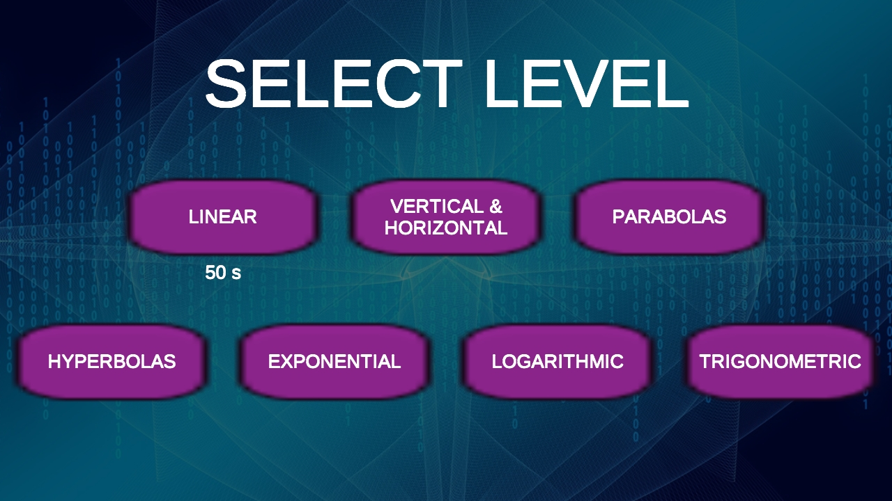
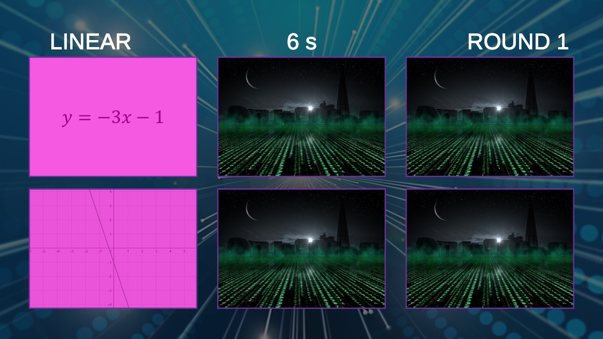
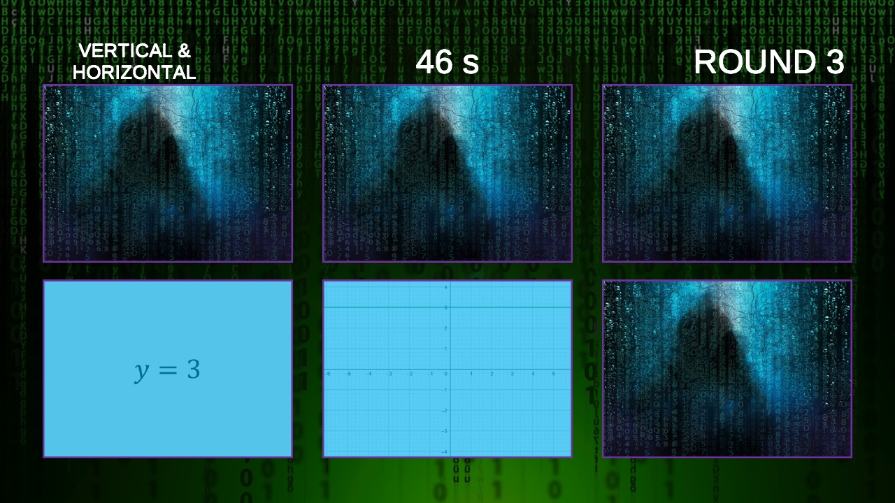
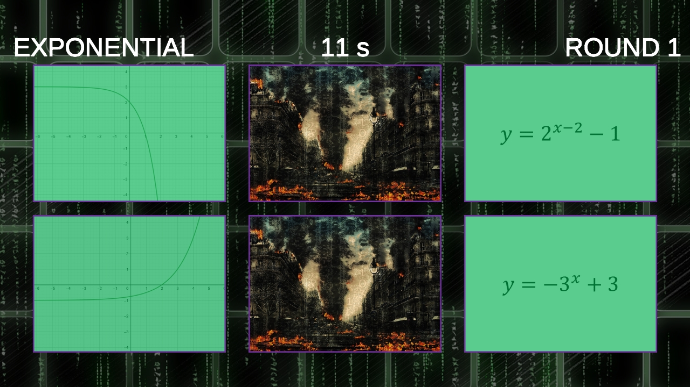
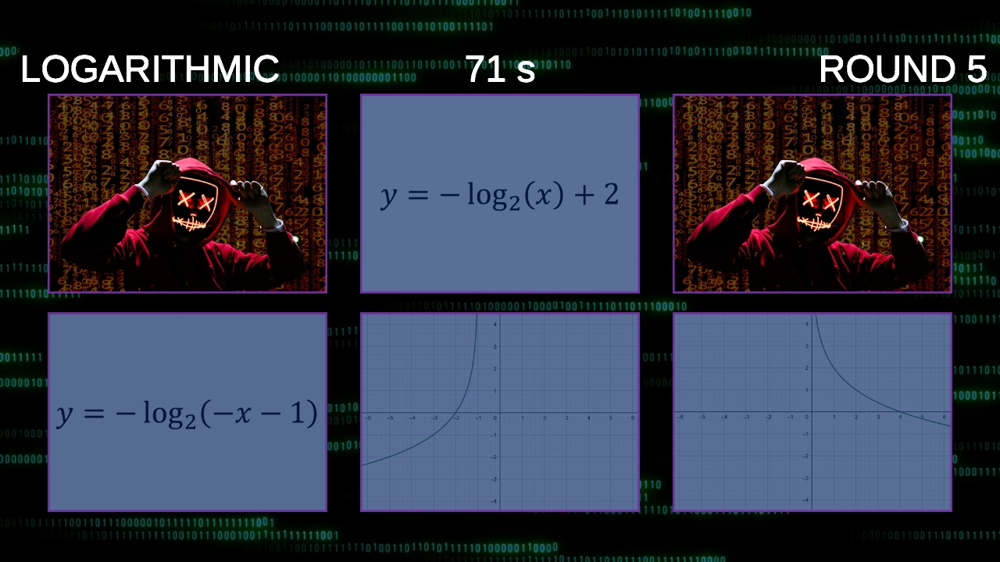
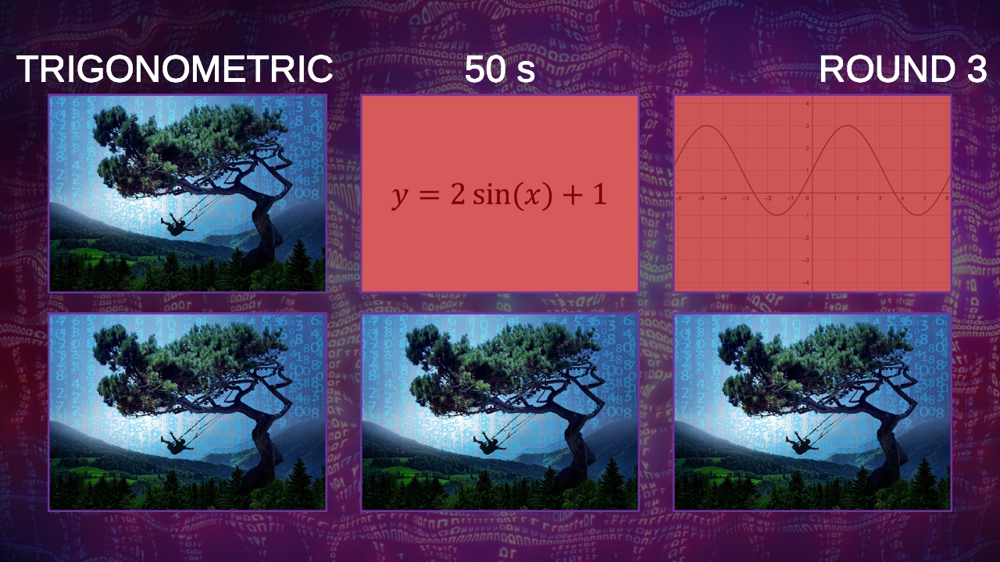
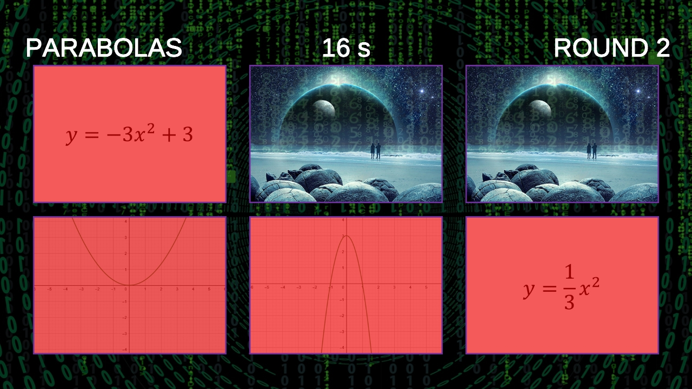
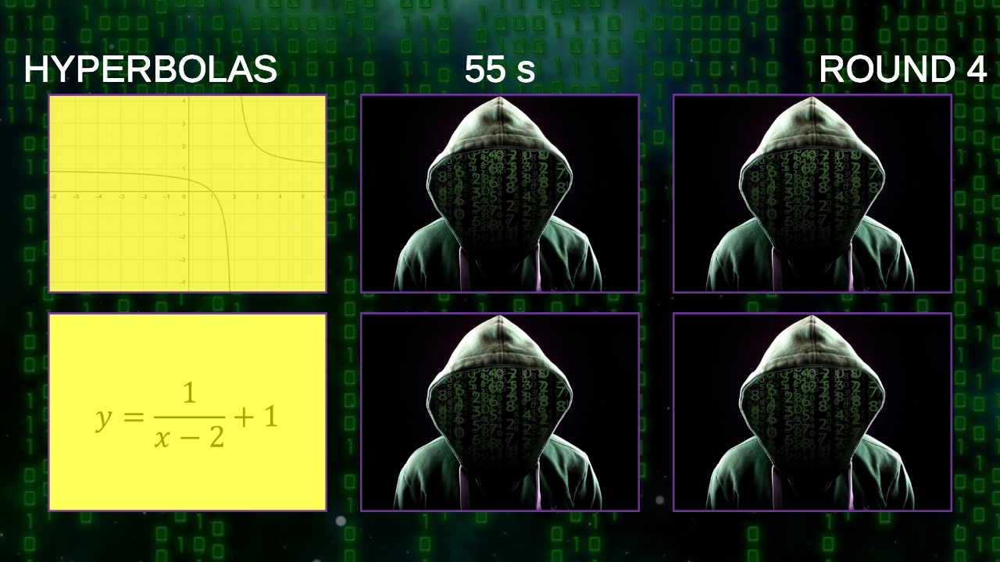

# Functions & Graphs

Functions & Graphs is a web-based mathematics learning game that offers a fun and interactive way to practice connecting function expressions with their corresponding graphs. In this game, players deepen their understanding of different types of functions and their visual representations.
Game Description

The game is based on the classic memory game, where players flip cards to find pairs of matching expressions and graphs. This approach makes learning both challenging and enjoyable, as players can test and improve their mathematical skills while experiencing the excitement of the game.

## Function Types

Players can practice with seven different types of functions:

- **Linear Functions** - Simple lines that represent a direct relationship between variables.
- **Axis-Aligned Functions** - Functions specifically oriented along the axes.
- **Quadratic Functions** - Parabolas that represent the shape of a quadratic function.
- **Logarithmic Functions** - Functions that describe logarithmic growth.
- **Exponential Functions** - Functions that illustrate exponential growth or decay.
- **Hyperbolas** - Functions that represent hyperbolic curves.
- **Trigonometric Functions** - Functions related to angular and periodic phenomena.

## Game Objectives

    Develop players' ability to recognize and connect functions with their graphs.
    Provide an interactive learning environment that makes mathematics enjoyable.
    Enhance problem-solving skills and memory.

## Instructions

- Select your desired function type.
- Flip the cards and search for pairs of expressions and graphs.
- Try to find all pairs as quickly as possible!

## Additional Information

If you have any questions or feedback about the game, feel free to contact the developer or leave suggestions for improvements. Enjoy your gaming experience!

## Screenshots

